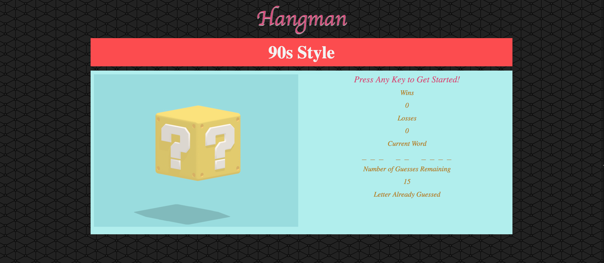
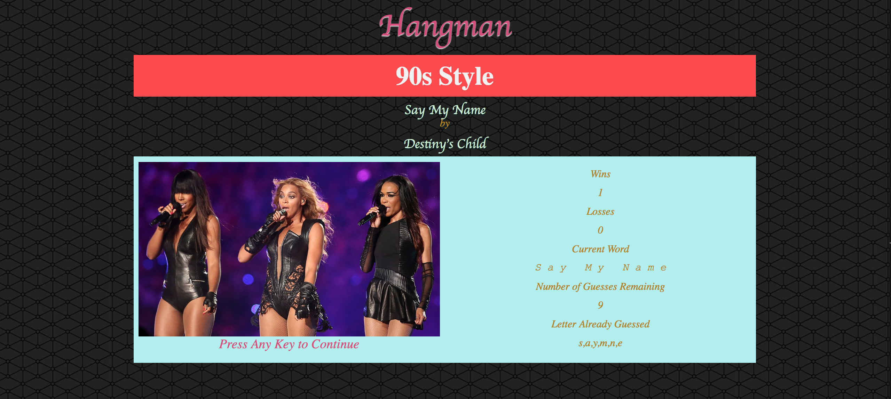
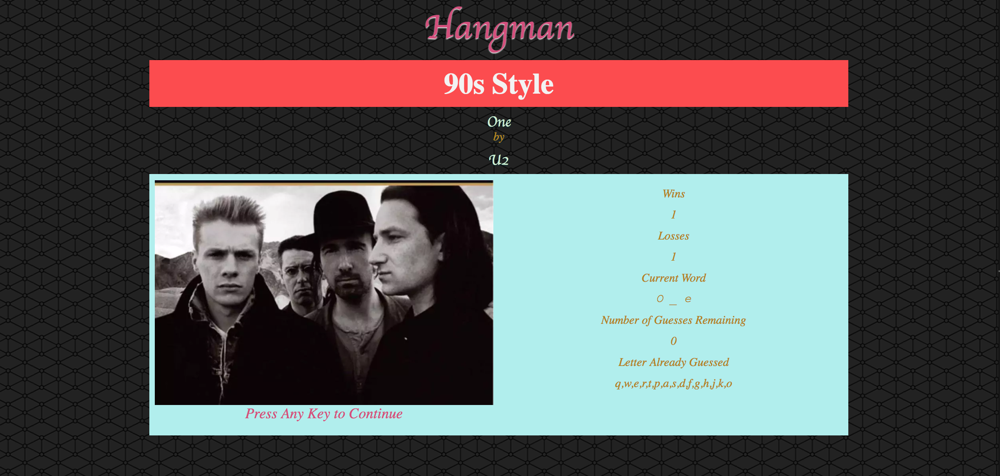

# Word-Guess-Game
JavaScript Assignment

## Table of Contents 
1. [Overview](#overview)
2. [Technologies](#technologies)
3. [Local Installation](#installation)
4. [App Display](#display)

## Overview

Hangman 90s Style is a game project created using the knowledge of HTML, CSS, and JavaScript. Just like traditional hangman game, player is presented with an unknown word or a series of words, which hint is the number of letters in each word. Player has to guess the letters correctly to form the meaningful words before going over the allowed number of wrong guesses. 

In this game, the word choices are songs from the 90s era. Player first clicks any key to start the game. Song name is then displayed as underscores; it might be a word or multiple words. User guesses is stored in the Letter Already Guessed. Each guess by player will reduce the Number of Guesses Remaining, which starts at 15. The goal of the game is for the player to guess the song name correctly before the Number of Guesses Remaining runs out. If the player guessed the song name correctly before the Number of Guesses Remaining, player wins and the song information will show. A win will increment by 1. If the Number of Guesses Remaining reaches 0 before the song name is guessed, the correct song information will show on screen, and a loss will be registered. Player clicks any key for the next game.  

## Technologies

* Math.floor(Math.random())
* document.onkeyup = function ()
* document.getElementById('idInHTML').innerHTML = variableName
* document.getElementById('idInHTML').setAttribute('src', image)
* .match(/[a-z]/i)
* .indexOf() === -1 
* .split
* .slice
* create a reset function to start a new game without reloading
* create an updateFields function to update HTML elements

## Installation

Download the files to your computer from https://github.com/hyxhuynh/Word-Guess-Game and open index.html using your browser (eg. Google Chrome)

Or visit: https://hyxhuynh.github.io/Word-Guess-Game/

## App Display

